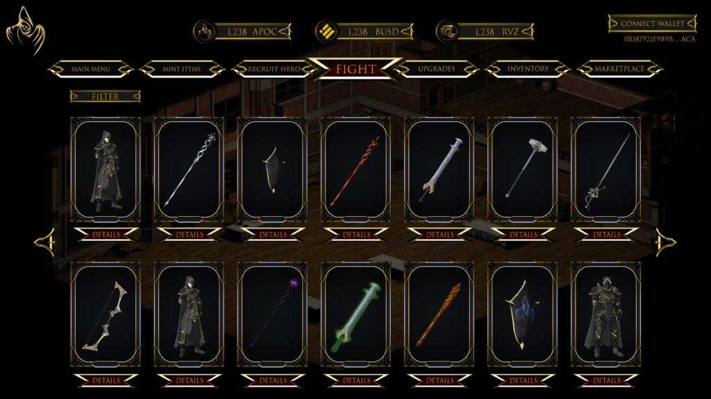

# Game Showcase

### APOCALYPSE NFT GAME

The aim is to revolutionize the NFT game sector in DeFi, making it the best web based game.

.png>)

## Play Apocalypse on your mobile device!

Apocalypse is an NFT web based game, players are able to play on most mobile devices as long the web browser is supported by connecting DeFi wallets.

This provides players to never miss a chance to fight their enemy at any given time and place. Mobility is the most crucial aspect as players are not always at their computer, therefore we created web based to even be played on mobile devices.

.png>)

.png>)

## Play Apocalypse on any device

Apocalypse game is built for the web, so everyone can play the game on any device they choose as long as there is a browser or a wallet with a built-in dApp.

.png>)

.png>)

## Play Apocalypse and join the community!

Discord is known to be the best community go to for chat, voice and discussion when comes to gaming.

We developed a fully operative NFT gaming discord channel for our players to enjoy with tons of features including language sections, marketplace section, concurrent upgrades, video AMA and even a full integrated support ticket system for a 1-on-1 discussion with our support team.\

.png>)

## &#x20;                   Apocalypse game interface

&#x20;    &#x20;

.png>)

.png>)

.png>)

.png>)

.png>)

.png>)
