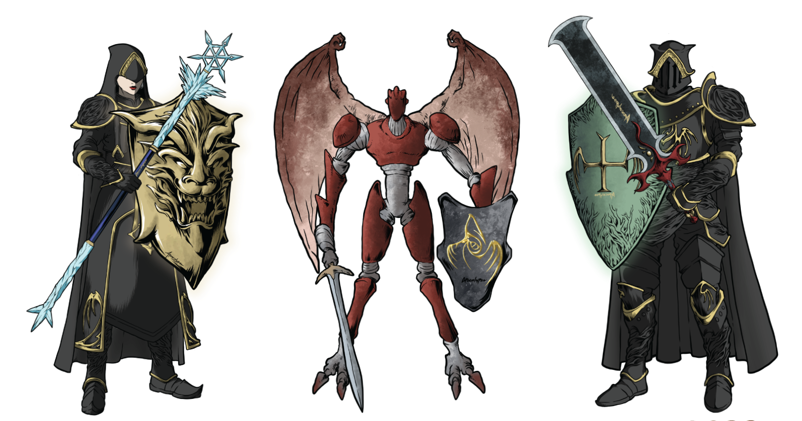

# PVP (Player Versus Player)

### PVP acronym is player versus player, PVP allows players to battle among each other while competing for the amount of LZN token staked.

<figure><figcaption></figcaption></figure>

\
Players are able to create as many PVP room as possible, per character per room. Players character would not require any minimum health point, level or experience point to be eligible for PVP room creation or joining PVP room.

To create a **PVP** room, players would need to open up their character inventory, select the character they want to utilize for **PVP** and select create **PVP** room. Player would then require to enter the desired stake amount of **LZN** they wish to stake for the **PVP** battle and click create.

Once **PVP** room is created, players would only require to wait till someone joins their **PVP** room and battle. Player would not required to be logged into the dApp or stay connected to the dApp, everything is automated by the smart contract and blockchain itself.

After battle ends, player who won will automatically receive their share of stake **LZN** directly into their wallet, however, player who lost will also get a chance to receive mineral as airdrop as well. There will be a 10% tax from the total amount stake received directly stored in the smart contract, all of the stored **LZN** are used for **Second Drop** function while the rebased **LZN** will be automatically sent to the **Black Hole** dEAd address.

One lucky player will receive a **Second Drop** reward from the **PVP** smart contract after the cooldown period ends, players might get lucky at any given time frame and not fixed. Second drop is a feature in the original **Helbreath** game where at given time, players might get lucky to receive an additional drop from mobs and players.

**Second Drop** only occurs once after every 24 hours cooldown (variable depending on **PVP** volume), it will not trigger within the first 24 hours but only after and will not have a exact timestamp when it deploys. Player might get a second drop from minutes to days after the cooldown period, it is totally random. Amount of **LZN** a player will receive depends on the amount of taxation and rebases in the smart contract, the more **LZN** staked within that time frame, the more **LZN** tokens a player will receive for their **Second Drop**.

Players are also able to join PVP rooms created by another player, there are no limit as to how many PVP a player / character. Characters would not require to equip any weapon / wand and shield to be able to participate in PVP. Characters that joins PVP will not recover their health point or lose their health point, however, if player wish to recover his health point, he would then require to re-equip his character in the character tab.&#x20;

Players would require to approve LZN allowances in the main dashboard before being able to stake their LZN for PVP, this command authorize the smart contract to receive the stake LZN from players. If players are having issue not being able to create or join a PVP room, do proceed to our guide / FAQ section or contact any of the mods / team members for help.

How a PVP smart contract determines the winner during battle is directly through the randomizer smart contract. Apocalypse game utilize five randomizer smart contracts for each features in the game. Character stats will not take into account or effect on battle, winning and losing are all random for now as we want a more fair system for all players to enjoy and compete among each other.

### FAQ Section

**Will I be able to create multiple PVP room with a single character?**

* No, only one PVP room can be created per character.\

**Will I be able to join another PVP room with the same character used to create a PVP room?**

* Yes, you will be able to join another PVP room, however, you are not able to join the same room with your other characters from the same wallet.

**Will Rare characters have higher chances of winning the Second Drop?**

* No, the randomizer are unique to certain criteria and are totally random as well.

**I got lucky and won the Second Drop, can I still have a change to win again or only for the next one?**

* Yes, it is possible to win consecutively.

**Can I use both of my own character in the same wallet address to battle among each other?**

* No, the smart contract will not allow same wallet address to battle among themselves even with different character.

**Can I delete my current PVP room and delist it?**

* Yes you can, however, there will be 1% tax for withdrawing your PVP room.

**Will I still have a chance receive mineral airdrops if I won?**

* No, only players who lost the battle will have a chance to receive mineral airdrops. This is to ensure players have a chance on receiving something even when they lost.

**Can I stake other tokens or coin instead of LZN?**

* No, we will only utilize LZN for now till further notice.

**Can I stake just 1 LZN?**

* No, for current situation, the minimum stake is 50 LZN and above. Minimum staked will be variable and updated according to LZN token value.

**Does my character level or stats improve my chances of winning?**

* No, it is totally random to ensure a more fair system. The main reason for not having those take into account is due to the matter of gas fee, when more functions are required for the smart contract to go through and check, the higher the gas fee is. To attain lowest gas fee possible, we ensure a fully randomizer to select winner which also ensures 100% unmanipulated system.
