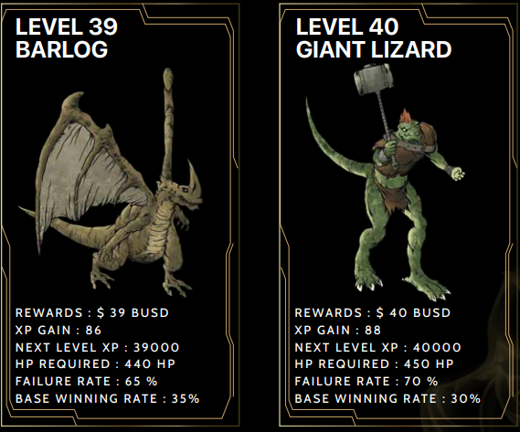

# Apocalypse Mobsters

Apocalypse consist of 50 levels of mobsters, the higher the level, the higher the rewards. Players would require to compete with every single level of mobsters till level 50. Levels are fixed according to heroes current XP. The higher the level, the lower the success rate.\
\

.png>)

## Mobsters Features

Apocalypse mobsters features!\
\

.png>)

.png>)

### Mobsters Stats & Data

.png>)

.png>)

.png>)

.png>)

.png>)

.png>)

.png>)

.png>)

.png>)

.png>)

.png>)

.png>)

.png>)

.png>)

.png>)

.png>)

.png>)

.png>)

.png>)

.png>)

.png>)

.png>)

.png>)

.png>)
