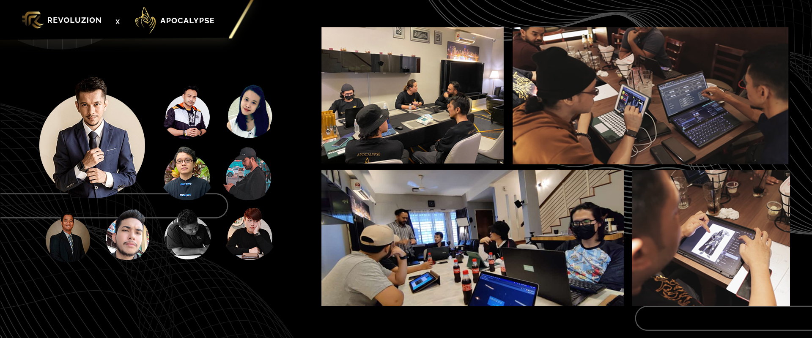

# Apocalypse Conceptualization

## <mark style="color:yellow;">Apocalypse Conceptualization</mark>

Revoluzion is a decentralized finance (DeFi) cryptocurrency network founded by Zackri Muizz in early 2021. The company's mission is to drive innovation and advancement within the DeFi space through the development of multiple ecosystem and project initiatives. Revoluzion is led by a team of 12 experienced professionals and is actively expanding.&#x20;

The company aims to utilize blockchain technology and smart contracts to revolutionize traditional financial systems and increase accessibility to financial services.

Revoluzion's team is composed of highly skilled professionals from a range of disciplines, including Solidity development, graphic design, web development, artwork sketching, security engineering, social media engineering, and more. The diversity of expertise within the team allows for the successful development and implementation of complex projects and initiatives. The team's strong technical capabilities ensure the security and functionality of Revoluzion's ecosystem and products.\
\
Solidity developers are responsible for writing and implementing smart contracts using the Solidity programming language. These contracts enable the creation and management of decentralized applications (DApps) on the Ethereum blockchain.

Graphic designers create visual concepts and designs for various projects, such as marketing materials, website layouts, and product packaging.

Web developers are responsible for the development and maintenance of web applications and websites. This can include tasks such as coding, testing, debugging, and optimizing websites for usability and performance.

Artwork sketching professionals create visual designs and concepts, typically by hand or through digital media, for use in various projects such as marketing materials, product packaging, and website layouts.

Security engineers ensure the security of systems and networks by identifying vulnerabilities and implementing measures to prevent unauthorized access or data breaches.

Social media engineers manage the organization's presence on social media platforms and develop strategies to increase engagement and followers. This can include tasks such as creating content, scheduling posts, and analyzing data to track the effectiveness of social media campaigns.
